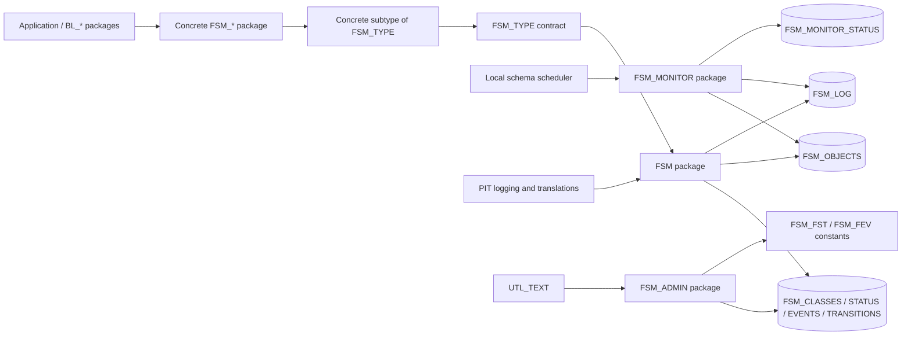
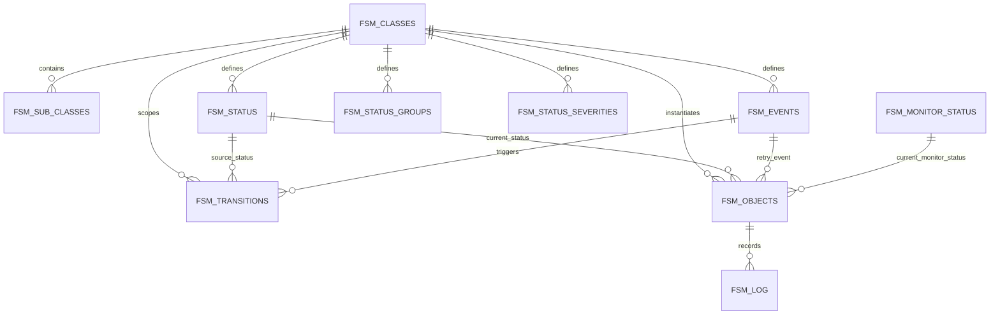

# Architecture map

## System shape

FSM is a reusable Oracle utility schema. Legal workflows are metadata; generic execution is PL/SQL; concrete applications supply a SQL subtype and domain packages.

## Components and source of truth

| Area | Responsibility | Primary source |
|---|---|---|
| Runtime contract | Common state-machine attributes and overridable lifecycle hooks | `FSM/core/types/fsm_type.tps`, `fsm_type.tpb` |
| Runtime engine | Initialization, event validation, transitions, persistence, retry, logging, escalation, finalization | `FSM/core/packages/fsm.pks`, `fsm.pkb` |
| Administration | Metadata CRUD and validation, export, diagrams, constant-package generation | `FSM/core/packages/fsm_admin.pks`, `fsm_admin.pkb` |
| Metadata model | Classes, subclasses, statuses, groups, severities, events, transitions | `FSM/core/tables/*.tbl` |
| Runtime state | Current object state and retry information | `FSM/core/tables/fsm_objects.tbl` |
| Audit trail | Status/event history and notifications | `FSM/core/tables/fsm_log.tbl` |
| Monitoring | Generic persisted class scan, metadata-driven scan of all configured classes, monitor signals, and current monitor projection | `FSM/core/packages/fsm_monitor.pks`, `fsm_monitor.pkb` |
| Monitor metadata | Global translated states and severity order | `FSM/core/tables/fsm_monitor_status.tbl` |
| Read models | Enriched metadata, state, valid commands, and graph edges | `FSM/core/views/*.vw` |
| Installation | Schema setup, initial data, generated objects, grants; optional local scheduler scripts are excluded from standard installation | `FSM/core/install.sql`, `FSM/install_scripts/`, `FSM/core/scripts/` |

## Metadata relationships

`FSM_TRANSITIONS` is the central join between a class/subclass, a source status, and an event. Its target status information determines the legal graph. `FSM_OBJECTS` is the mutable runtime projection; `FSM_LOG` is its history.

## Architectural invariants

- `FSM_TYPE` is a contract and delegation boundary, not the main home of business logic.
- The `FSM` package owns generic transition mechanics; concrete `FSM_*` packages orchestrate domain behavior; `BL_*` packages make business decisions.
- Metadata defines which transitions are legal. Implementations should use generated `FSM_FST` and `FSM_FEV` constants rather than literal identifiers.
- Concrete class visibility follows Oracle type visibility and `EXECUTE` grants.
- Installation order matters: subtype, class registration, metadata, generated constants, then concrete handlers/business logic.
- PIT is an external dependency for logging/assertions and translations; UTL_TEXT is required by `FSM_ADMIN` for generation.
- Monitoring is centrally defined but locally invoked. `FSM_MONITOR` never calls consuming schemas and never instantiates concrete FSM types.
- Scheduler jobs are optional objects of consuming schemas. The scripts in `FSM/install_scripts/optional/` are not called by standard installation and create monitor jobs disabled so that activation remains an explicit local decision.
