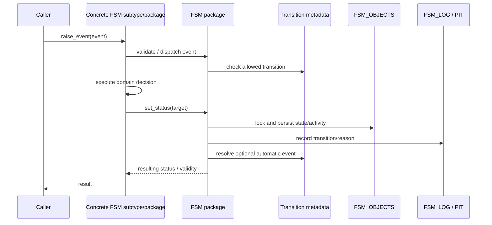
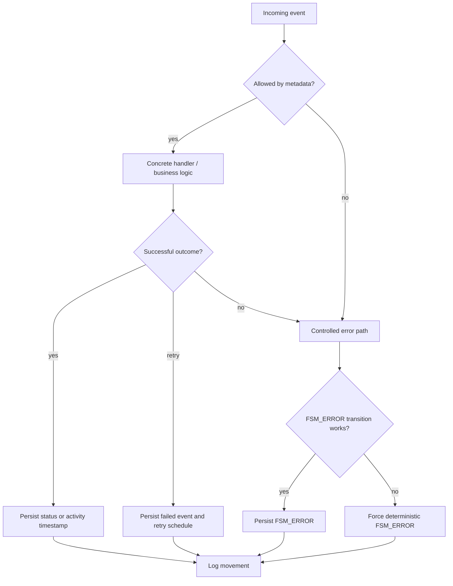

# Runtime flow map

## Normal event path

The detailed implementation lives primarily in `FSM/core/packages/fsm.pkb`; the overridable contract and hooks are in `FSM/core/types/fsm_type.tps`.

## Failure and retry branches

## Escalation time model

- `FSM_LAST_CHANGE_DATE` represents relevant activity/event time.
- `FSM_STATUS_CHANGE_DATE` changes only when the status changes.
- A status with escalation basis `EVENT` measures silence; basis `STATUS` measures time spent in the status.
- A local job calls `FSM_MONITOR.SCAN` for one class.
- The scan compares the calculated state with the persisted monitor state in `FSM_OBJECTS`.
- Each newly crossed upward state is returned and logged; a downward movement returns and logs the new current state, including `OK`.
- `FSM_OBJECTS_V.STATUS_STATE` exposes the last monitor state persisted by a scan.
- The scan operates in an autonomous transaction, so later local signal handling cannot roll back the detected state or its log entry.
