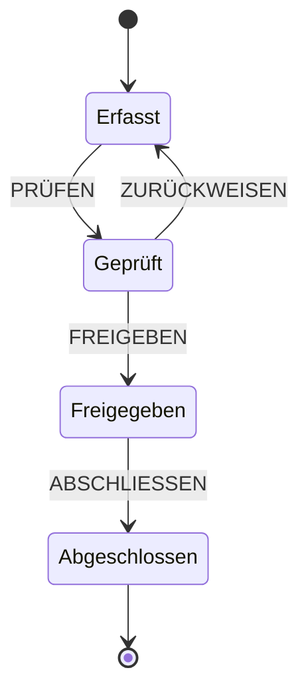
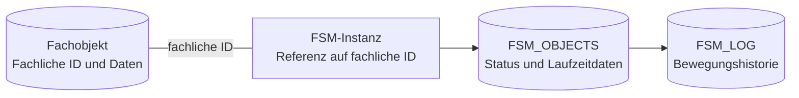
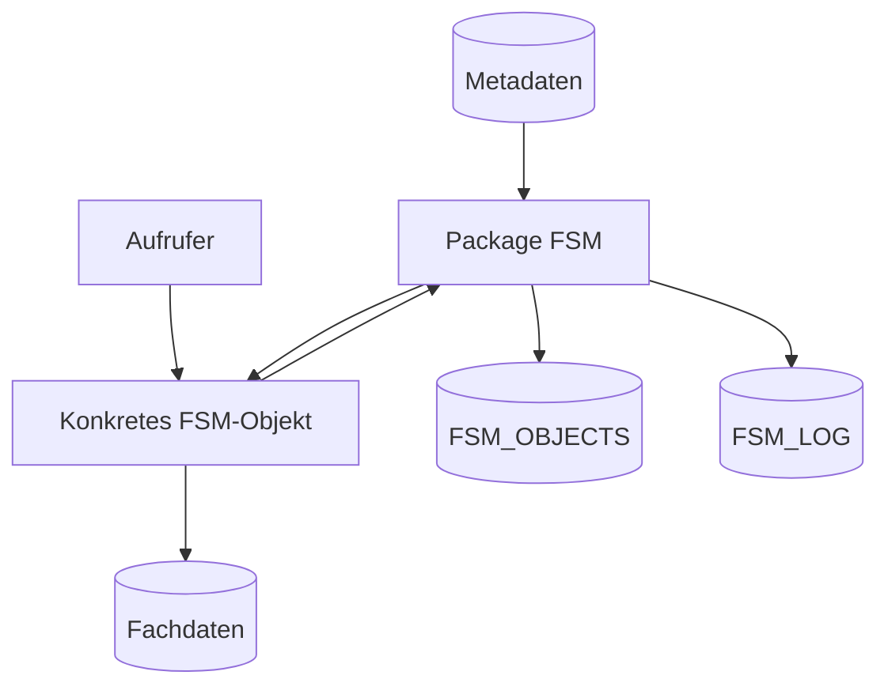

---
tags:
  - fsm
  - grundlagen
  - plsql
---

# Einführung in Finite State Machines

Viele fachliche Objekte durchlaufen im Laufe ihres Lebens klar unterscheidbare Phasen. Ein Auftrag wird beispielsweise erfasst, geprüft, freigegeben und schließlich abgeschlossen. Der aktuelle Zustand bestimmt dabei die verfügbaren Schritte: Auf `Erfasst` folgt die Prüfung, auf eine erfolgreiche Prüfung die Freigabe und auf die Freigabe der Abschluss.

Eine [[Glossar/FSM|Finite State Machine]] macht solche Regeln ausdrücklich. Sie beschreibt den aktuellen Zustand eines Objekts, die daraus zulässigen Änderungen und ihre Auslöser. Damit wird der fachliche Lebenszyklus zu einem zusammenhängenden, nachvollziehbaren Modell.

## Die Grundidee

Ein endlicher Zustandsautomat besteht im Kern aus:

- einer endlichen Menge von [[Glossar/Status|Status]],
- einer Menge von [[Glossar/Ereignis|Ereignissen]],
- Regeln für zulässige [[Glossar/Transition|Transitionen]],
- einem [[Glossar/Initialstatus|Initialstatus]] und
- optional einem oder mehreren [[Glossar/Terminalstatus|Terminalstatus]].

Ein Ereignis beschreibt, *was geschehen ist oder angefordert wird*. Der aktuelle Status und die Transitionstabelle bestimmen, *welche Zustandsänderung daraus entstehen darf*.



Im Zustand `Erfasst` ist beispielsweise `PRÜFEN` erlaubt. `ABSCHLIESSEN` gehört zum Zustand `Freigegeben`. Die Menge der verfügbaren Ereignisse ergibt sich somit aus dem aktuellen Status.

## Warum ein Zustandsautomat?

Das Hauptargument für eine FSM liegt in der strukturierten Definition von Status und Statusübergängen. Ein fachlicher Prozess wird als Folge klar benannter Situationen betrachtet. Für jeden Status wird beschrieben, welche Ereignisse dort verarbeitet werden und in welchen nächsten Status sie führen.

### Fachliche Prozesse werden klar strukturiert

Das Denken in Statusübergängen gibt dem fachlichen Prozess eine eindeutige Form. Der aktuelle Status beschreibt die gegenwärtige Situation des Fachobjekts. Die von dort erlaubten Ereignisse beschreiben die verfügbaren Handlungsmöglichkeiten. Die Transitionen zeigen, welche nächste Situation daraus entsteht.

Der gesamte Lebenszyklus wird so als Graph sichtbar und prüfbar. Fachbereich und Entwicklung können über dieselben Status, Ereignisse und Übergänge sprechen. Trigger, Packages, Benutzeroberflächen und Hintergrundverarbeitung erhalten dieselbe verbindliche Auskunft über die aktuell verfügbaren Aktionen.

### Jeder Implementierungsschritt bleibt überschaubar

Bei der Implementierung steht jeweils ein konkreter Übergang im Mittelpunkt: der aktuelle Status, das eintretende Ereignis, die zugehörige fachliche Aktion und der daraus folgende Status. Die Entwicklung kann diesen Ausschnitt vollständig betrachten und umsetzen.

Diese Fokussierung senkt die Komplexität der Anwendung. Eine Ereignisroutine bearbeitet den aktuell relevanten Übergang und übergibt das Ergebnis wieder an die FSM. Die weiteren Prozessschritte werden durch ihre eigenen Transitionen beschrieben und ausgeführt. Auch ein umfangreicher Gesamtprozess entsteht dadurch aus kleinen, klar abgegrenzten Einheiten.

### Verhaltensänderungen werden über Metadaten beschrieben

Status, Ereignisse und Transitionen liegen im [[Glossar/Metadatenmodell|Metadatenmodell]]. Änderungen am Prozessablauf können dadurch direkt am Zustandsgraphen vorgenommen werden. Ein neuer erlaubter Übergang, ein automatisches Folgeereignis oder eine andere Reihenfolge von Prozessschritten wird über die zugehörigen Metadaten beschrieben.

Die zentrale Laufzeit wertet dieses Modell bei jeder FSM-Instanz aus. Zukünftige Änderungen am Ablauf verwenden damit dieselbe Ausführungslogik und lassen sich mit geringem Implementierungsaufwand umsetzen. Fachliche Aktionen bleiben in ihren PL/SQL-Handlern und werden über Ereignis und Transition in den neuen Ablauf eingebunden.

### Wiederkehrende technische Aufgaben stehen allen FSM-Typen bereit

Der FSM-Kern implementiert die allgemeinen Aufgaben einmal:

- Statusübergänge werden nach einer einheitlichen Reihenfolge ausgeführt.
- Ereignisse werden ausgelöst, gegen den aktuellen Status geprüft und an die fachliche Verarbeitung übergeben.
- Jede Bewegung eines Fachobjekts wird nach denselben Regeln protokolliert.
- Automatische Folgeereignisse werden bis zu einem stabilen Status verarbeitet.

Jeder abgeleitete FSM-Typ erhält diese Fähigkeiten über `FSM_TYPE` und kann sie unmittelbar verwenden. Eine konkrete Implementierung konzentriert sich dadurch auf ihre Status, Ereignisse und fachlichen Aktionen. Persistenz des FSM-Zustands, Protokollierung und die technische Ausführung der Übergänge übernimmt das Framework.

Die FSM regelt den Ablauf. Fachliche Handler bewerten beispielsweise eine Prüfung und bestimmen den daraus folgenden Zielstatus.

## Die FSM begleitet das Fachobjekt

Eine FSM repräsentiert den Lebenszyklus eines Fachobjekts und begleitet dessen Veränderungen. Das Fachobjekt selbst bleibt Bestandteil des fachlichen Datenmodells. Seine Tabellen enthalten weiterhin die fachlichen Attribute, Beziehungen und Regeln.

Die FSM speichert ergänzend den aktuellen Prozessstatus, die erlaubten Folgeereignisse und die Historie der Bewegungen. Eine Referenz auf die fachliche ID verbindet beide Seiten. So kann beispielsweise ein Datenträger seine technischen und beschreibenden Daten in den Datenträgertabellen behalten, während die zugehörige FSM festhält, in welcher Bearbeitungsphase er sich befindet und welche Schritte folgen dürfen.



Diese Aufteilung bewahrt das fachliche Datenmodell und ergänzt es um eine einheitliche Prozesssteuerung. Ein Fachobjekt kann seine eigene Persistenz und seine eigene Fachlogik verwenden; die FSM übernimmt die zeitliche Abfolge seiner fachlichen Veränderungen.

## Umsetzung in Oracle PL/SQL

Das Framework teilt Modell, Laufzeitsteuerung und fachliche Implementierung bewusst auf.

Das [[Glossar/Metadatenmodell|Metadatenmodell]] speichert Klassen, Subklassen, Status, Ereignisse und Transitionen in relationalen Tabellen. Dadurch kann die Laufzeit feststellen, welches Ereignis für eine konkrete Instanz erlaubt ist und welcher Status darauf folgt.

Das Package `FSM` ist die gemeinsame Ablaufsteuerung. Es prüft Ereignisse, führt Statuswechsel aus, persistiert die gemeinsamen FSM-Attribute, schreibt das Log und verarbeitet [[Glossar/Automatisches Ereignis|automatische Ereignisse]]. Es sorgt damit dafür, dass alle konkreten Automaten denselben technischen Lebenszyklus einhalten.

Die fachliche Ausprägung wird als konkreter Oracle-[[Glossar/Objekttyp|Objekttyp]] implementiert. Der Typ legt fest, welche Daten eine Instanz enthält und welche Methoden auf ihr aufgerufen werden können. Eine FSM-Instanz enthält beispielsweise ihre ID und ihren aktuellen Status und stellt Methoden wie `RAISE_EVENT` und `SET_STATUS` bereit. Ein abgeleiteter Typ ergänzt die Daten und Methoden seiner fachlichen Aufgabe.



## Warum Oracle-Objekttypen verwendet werden

Objekte erweitern die Möglichkeiten von PL/SQL. Ein Oracle-Objekttyp definiert einen eigenen Datentyp und kann diesem Typ Methoden mitgeben. Eine Variable dieses Typs enthält dadurch die Daten einer FSM-Instanz und bietet zugleich die passenden Operationen für diese Instanz an.

Oracle kann einen Objekttyp aus einem anderen Objekttyp ableiten. Der abgeleitete Typ übernimmt dessen Attribute und Methoden und ergänzt sie für seine konkrete Aufgabe. Diese Weitergabe ist der praktische Grund für den Einsatz von Objekttypen im FSM-Framework.

`FSM_TYPE` stellt die gemeinsame Grundlage bereit. Der Typ enthält die Daten, die jede FSM benötigt, etwa FSM-ID, Klasse, Subklasse, Status und erlaubte Folgeereignisse. Außerdem stellt er die Methoden bereit, die der Laufzeitkern auf jeder FSM ausführen können muss:

- `SET_STATUS` führt einen Statuswechsel aus.
- `RAISE_EVENT` nimmt ein Ereignis entgegen.
- `PERSIST_STATE` speichert die zusätzlichen Daten einer konkreten FSM.
- `LEAVE_STATUS`, `BEFORE_TRANSITION`, `ENTER_STATUS` und `AFTER_TRANSITION` bieten feste Stellen für fachliche Aktionen.

Ein konkreter Typ wird mit `UNDER FSM_TYPE` abgeleitet. Er erhält damit die gemeinsamen Daten und Methoden. Mit `OVERRIDING` kann er eine Methode an seine Aufgabe anpassen. `FSM_REQ_TYPE` ergänzt beispielsweise die Daten einer Anfrage und implementiert, wie Anfrageereignisse verarbeitet und Anfragedaten gespeichert werden.

Das zentrale Package `FSM` arbeitet mit `FSM_TYPE`. Deshalb verwendet derselbe Code jede konkrete FSM. Beim Aufruf von `PERSIST_STATE` oder `RAISE_EVENT` wählt Oracle die Methode des konkreten Objekttyps aus. Für das Package sieht der Aufruf immer gleich aus:

```sql
p_fsm.persist_state;
l_result := p_fsm.raise_event(p_fsm.fsm_fev_list);
```

Ein konkretes Objekt führt dabei seine eigene Implementierung aus. So kann `FSM.SET_STATUS` die Reihenfolge von Persistenz, Logging und automatischen Ereignissen zentral vorgeben, während jeder fachliche Typ seine eigenen Daten speichert und seine eigenen Ereignisse bearbeitet.

Die Vererbung stellt damit auch die wiederkehrenden FSM-Aufgaben bereit. Ein neuer FSM-Typ erbt die Methoden für Statuswechsel, Ereignisverarbeitung, Logging, Benachrichtigung, Retry und Finalisierung. Seine Implementierung ergänzt die Referenz auf das Fachobjekt und die fachlichen Reaktionen an den vorgesehenen Methoden. Die technischen Details des allgemeinen FSM-Ablaufs bleiben im Kern gebündelt.

### Direkte Fachaufrufe durch überschriebene Methoden

Ein zentrales Utility-Package kann zentrale Funktionen zum Ändern eines Status oder zum Loggen bereitstellen. Für die Auswahl der jeweils zuständigen Fachlogik führt dieser Ansatz Package- und Methodennamen als Metadaten oder Zeichenketten und führt sie zur Laufzeit als dynamischen PL/SQL-Block aus, beispielsweise über `EXECUTE IMMEDIATE`. Die Prüfung von Existenz und Parametersignatur erfolgt dabei beim Ausführen des dynamischen Blocks.

Der geerbte Objekttyp stellt dafür einen statisch kompilierten Weg bereit. Die allgemeine Funktionalität ist bereits in `FSM_TYPE` und im Package `FSM` implementiert. Der konkrete Typ überschreibt gezielt die Methoden, an denen seine Fachlogik beteiligt ist, und ruft dort das zuständige Package direkt auf:

```sql
overriding member function raise_event(
  self in out nocopy fsm_req_type,
  p_fev_id in varchar2,
  p_msg in varchar2 default null,
  p_msg_args in msg_args default null)
  return number
as
begin
  return fsm_req.raise_event(
    p_req => self,
    p_fev_id => p_fev_id,
    p_msg => p_msg,
    p_msg_args => p_msg_args);
end raise_event;

overriding member procedure persist_state(
  self in out nocopy fsm_req_type)
as
begin
  fsm_req.set_status(self);
end persist_state;
```

Diese direkten Aufrufe werden gemeinsam mit Typ und Package kompiliert. Oracle prüft dabei Namen, Parameter und Datentypen. Der zentrale Laufzeitkern ruft weiterhin `p_fsm.raise_event(...)` oder `p_fsm.persist_state` auf; die überschriebene Methode verbindet diesen allgemeinen Aufruf mit dem konkreten Fachpackage.

Auf diese Weise verbindet die Objektvererbung zwei Ziele: Die vollständige FSM-Funktionalität steht jeder abgeleiteten Instanz unmittelbar zur Verfügung, und die projektspezifischen Methoden bleiben als explizite PL/SQL-Aufrufe sichtbar und werden beim Kompilieren geprüft.

Die Typdeklaration unterstützt diese Aufteilung unmittelbar:

- `NOT INSTANTIABLE` kennzeichnet `FSM_TYPE` als gemeinsame Grundlage für abgeleitete Typen.
- `NOT FINAL` erlaubt die Definition fachlicher Typen mit `UNDER FSM_TYPE`.
- Membermethoden legen fest, welche Aufrufe der Laufzeitkern verwenden kann.
- `OVERRIDING` verbindet einen solchen Aufruf mit der Implementierung des konkreten Typs.

Damit erfüllt `FSM_TYPE` praktisch die Aufgabe eines Interfaces: Es gibt dem Laufzeitkern eine einheitliche Liste verfügbarer Methoden, und jeder abgeleitete FSM-Typ liefert die zu seiner Fachaufgabe passenden Implementierungen. Der Fachbegriff für die Auswahl der konkreten Methode zur Laufzeit lautet [[Glossar/Polymorphie|Polymorphie]].

Die abgeleiteten Objekttypen bleiben kompakt und rufen Methoden eines Packages auf, das die eigentliche Fachlogik ausführt, wie im Beispiel oben gezeigt (`fsm_req.raise_event`). Durch diese Trennung wird die Implementierung der Fachlogik zu einem gewöhnlichen PL/SQL-Problem. Der Objekttyp stellt als zusätzliche Schicht das Interface zur Verfügung.

## Zusammenspiel bei einem Ereignis

Wenn ein Aufrufer ein Ereignis an eine konkrete FSM-Instanz übergibt, arbeiten die Ebenen zusammen:

1. Die konkrete `RAISE_EVENT`-Methode nimmt das fachliche Ereignis entgegen.
2. Die Metadaten legen fest, ob das Ereignis im aktuellen Status erlaubt ist.
3. Der fachliche Handler ermittelt das Ergebnis beziehungsweise den Zielstatus.
4. Das geerbte `SET_STATUS` delegiert an die zentrale Implementierung im Package `FSM`.
5. `FSM.SET_STATUS` persistiert und protokolliert den Übergang in festgelegter Reihenfolge und ruft dabei polymorph die Hooks des konkreten Objekttyps auf.
6. Ein konfiguriertes automatisches Folgeereignis durchläuft denselben Ablauf synchron erneut.

Die genaue zeitliche Reihenfolge beschreibt [[01_Architektur/Laufzeit-und-Lifecycle|Laufzeit und Lifecycle]]. Die technische Struktur der beteiligten Objekte zeigt [[01_Architektur/Architekturüberblick|Architekturüberblick]].
