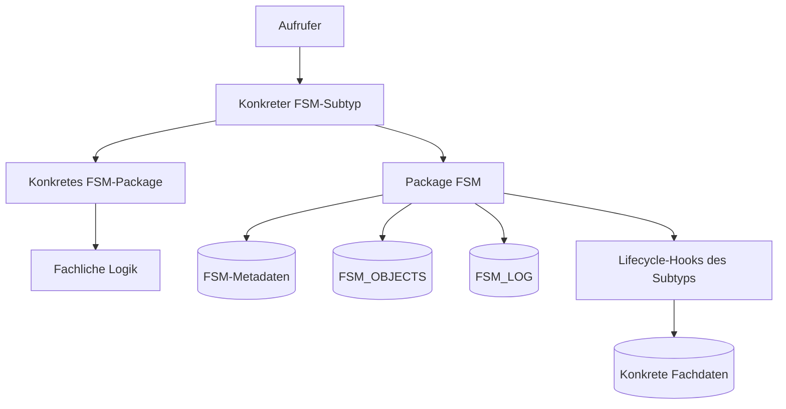

---
tags:
  - architektur
  - fsm
---

# Architekturüberblick

FSM trennt drei Fragen, die in prozeduraler Fachlogik sonst leicht miteinander vermischt werden: Welche Prozessschritte sind grundsätzlich erlaubt? Welches fachliche Ergebnis hat ein konkretes Ereignis? Wie wird die daraus folgende Statusänderung technisch zuverlässig ausgeführt?

Status, Ereignisse und Übergänge werden als [[Glossar/Metadatenmodell|Metadaten]] gespeichert. Fachliche Handler entscheiden, welches Ergebnis ein Ereignis hat. Das Package `FSM` führt den Statuswechsel einheitlich aus. Eine grundlegende Einführung in dieses Modell und die Rolle der Oracle-Objekttypen bietet [[00_Start/Einführung-in-Finite-State-Machines|Einführung in Finite State Machines]].

## Schichten

### Metadaten

`FSM_CLASSES`, `FSM_SUB_CLASSES`, `FSM_STATUS`, `FSM_EVENTS` und `FSM_TRANSITIONS` beschreiben den erlaubten Zustandsgraphen. `FSM_ADMIN` pflegt und validiert diese Daten.

### Laufzeitkern

`FSM_TYPE` stellt die gemeinsamen Attribute und Methoden aller FSM-Instanzen bereit. Fachliche Objekttypen werden davon abgeleitet, übernehmen diese Fähigkeiten und passen ausgewählte Methoden an ihre Aufgabe an. Das Package `FSM` verwendet dadurch für alle konkreten Automaten dieselben Methoden und übernimmt Ereignisprüfung, Statuswechsel, Persistenz der gemeinsamen Attribute, Logging, Autoevents, Retry und Finalisierung.

### Konkrete Implementierung

Ein Subtyp wie `FSM_REQ_TYPE` repräsentiert eine konkrete Klasse. Sein Type Body bleibt dünn und delegiert an ein Package wie `FSM_REQ`. Fachliche Entscheidungen gehören in lokale Business-Packages.

### Persistenz

`FSM_OBJECTS` hält den gemeinsamen Laufzeitzustand. Die Tabellen der Anwendung halten das Fachobjekt mit seinen Attributen und Beziehungen. Der konkrete FSM-Typ verbindet beide Bereiche über die fachliche ID. Eine konkrete View führt die Sichten für Laden und Auswertung zusammen.

Die FSM wirkt damit als Prozessbegleiter des Fachobjekts. Sie speichert Status und Bewegungshistorie und ruft bei Übergängen die fachlichen Methoden auf. Das Fachobjekt bleibt in seinem eigenen Datenmodell verankert.

## Entwurfsprinzipien

- Das Denken in Status und einzelnen Übergängen strukturiert den fachlichen Prozess.
- Jeder Handler bearbeitet einen klar abgegrenzten Übergang vom aktuellen zum nächsten Status.
- Der Prozessgraph ist metadatengetrieben.
- Änderungen am Ablauf werden über Status-, Ereignis- und Transitionsmetadaten beschrieben.
- Fachliche Entscheidungen bleiben in PL/SQL.
- Fachobjekt und FSM besitzen getrennte Persistenzbereiche und sind über die fachliche ID verbunden.
- Der FSM-Kern implementiert Statusübergänge, Ereignissteuerung und Bewegungslogging einmal für alle konkreten FSM-Typen.
- `FSM.SET_STATUS` besitzt die Ablauf- und Transaktionskontrolle.
- Konkrete Subtypen erweitern über [[Glossar/Lifecycle-Hook|Lifecycle-Hooks]].
- Automatische Ereignisse werden synchron bis zu einem stabilen Zustand verarbeitet.
- Logs gehören zur selben fachlichen Statusänderung wie die Persistenz.

Siehe auch [[01_Architektur/Komponenten-und-Verantwortlichkeiten|Komponenten und Verantwortlichkeiten]] und [[01_Architektur/Datenmodell|Datenmodell]].
