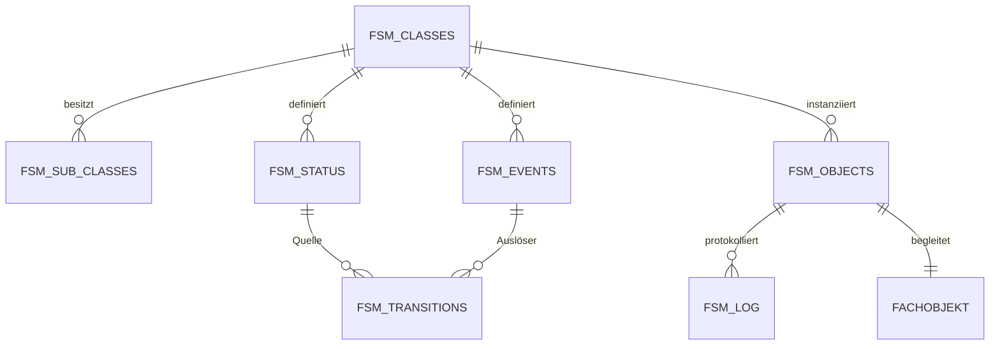

# Datenmodell

## Metadatenobjekte

| Tabelle | Inhalt |
| --- | --- |
| `FSM_CLASSES` | FSM-Klassen und implementierender SQL-Typ |
| `FSM_SUB_CLASSES` | Varianten innerhalb einer Klasse |
| `FSM_STATUS_GROUPS` | Gruppierung und Darstellung von Status |
| `FSM_STATUS_SEVERITIES` | Darstellungs- und Story-Schweregrade |
| `FSM_STATUS` | Status, Initial-/Terminalkennzeichen, Retry- und Eskalationswerte |
| `FSM_EVENTS` | Ereignisse, Meldungen und Darstellungsinformationen |
| `FSM_TRANSITIONS` | erlaubte Ereignisse je Quellstatus und mögliche Zielstatus |

Eine Transition ist über Klasse und Subklasse eingegrenzt. Sie kann ein automatisches Ereignis, eine erforderliche Rolle, einen Ergebnisstatus sowie einen statischen Übergangsgrund definieren.

## Laufzeitobjekte

`FSM_OBJECTS` speichert pro Instanz:

- technische `FSM_ID`
- Klasse, Subklasse und aktuellen Status
- Ergebnis beziehungsweise Gültigkeit
- Liste der erlaubten Folgeereignisse
- fehlgeschlagenes Ereignis und Retryplanung
- Zeitpunkt der letzten Aktivität
- Zeitpunkt des letzten tatsächlichen Statuswechsels

`FSM_LOG` speichert die Historie einschließlich Status, Ereignis, vorherigem Status, Meldung, Argumenten sowie statischem und dynamischem Übergangsgrund.

## Verbindung zum Fachobjekt

Das Fachobjekt verbleibt in den Tabellen der jeweiligen Anwendung. Dort liegen seine fachlichen Attribute, Beziehungen und Integritätsregeln. Die FSM-Tabellen ergänzen dieses Modell um Prozessstatus und Bewegungshistorie.

Ein konkreter FSM-Typ enthält dazu eine Referenz auf die fachliche ID. Über diese ID lädt und persistiert das konkrete FSM-Package die zugehörigen Fachdaten. `FSM_OBJECTS` verwaltet parallel die technische `FSM_ID` und den aktuellen Zustand des Automaten. Je nach Anwendung kann dieselbe ID beide Rollen erfüllen oder eine eigene Zuordnungstabelle beide IDs verbinden.

Die Sample-App zeigt die getrennte Variante: `FSM_REQUESTS.REQ_ID` ist die fachliche ID der Berechtigungsanfrage, `FSM_REQUESTS.REQ_FSM_ID` verweist eindeutig auf `FSM_OBJECTS.FSM_ID`. `FSM_REQ_TYPE` führt beide Werte während der Verarbeitung gemeinsam in einer Instanz.

| Bereich | Gespeicherte Informationen |
| --- | --- |
| Fachliche Tabellen | Fachliche ID, Attribute, Beziehungen und Geschäftsregeln |
| konkreter FSM-Typ beziehungsweise Zuordnung | Verbindung zwischen fachlicher ID und `FSM_ID` |
| `FSM_OBJECTS` | Klasse, Subklasse, Status, Folgeereignisse und Laufzeitdaten |
| `FSM_LOG` | zeitliche Folge der Ereignisse und Statusbewegungen |

Diese Trennung erlaubt die Ergänzung einer FSM zu einem bestehenden fachlichen Datenmodell. Die Fachanwendung behält ihre Datenstruktur; die FSM stellt den geregelten Lebenszyklus bereit.

## Beziehungen

Die Views mit Suffix `_V` ergänzen Namen, Beschreibungen und abgeleitete Werte. Die Business-Layer-Views `BL_FSM_ACTIVE_STATUS_EVENT`, `BL_FSM_EDGES` und `BL_FSM_NEXT_COMMANDS` stellen die für Laufzeit, Graph und UI benötigten Ausschnitte bereit.
