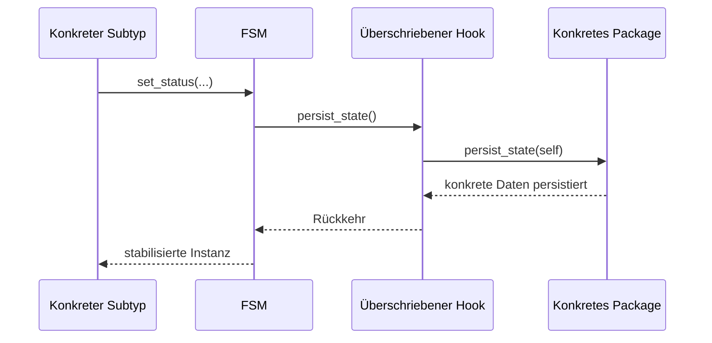

# Komponenten und Verantwortlichkeiten

| Komponente | Verantwortung |
| --- | --- |
| `FSM_TYPE` | Abstrakter Vertrag und polymorphe Einstiegspunkte |
| `FSM` | Laufzeitsteuerung, gemeinsame Persistenz, Logging, Autoevents, Fehler- und Retrypfade |
| `FSM_ADMIN` | Pflege, Prüfung und Export der Metadaten; Erzeugung der Konstantenpackages |
| `FSM_<KLASSE>_TYPE` | Konkreter SQL-Subtyp; Konstruktoren und überschriebene Hooks |
| `FSM_<KLASSE>` | Ereignisdispatch, konkrete Persistenz und klassenbezogene Orchestrierung |
| `BL_<DOMÄNE>` | Fachliche Entscheidungen und Aktionen |
| `FSM_OBJECTS` | Gemeinsamer Laufzeitzustand aller Instanzen |
| konkrete Tabelle | Zuordnung zur Fachinstanz und konkrete Attribute |
| `FSM_LOG` | Chronik der Status-, Ereignis- und Benachrichtigungseinträge |

## Aufrufrichtung

Der konkrete Subtyp ruft die geerbten Methoden `SET_STATUS`, `LOG_REASON`, `NOTIFY` und `RETRY` auf. Die Implementierung liegt im Package `FSM`. Innerhalb von `FSM.SET_STATUS` werden polymorph die Hooks des tatsächlichen Subtyps aufgerufen.

## Abgrenzung

Der konkrete Handler bestimmt das fachliche Ergebnis und den Zielstatus direkt oder über `FSM.GET_NEXT_STATUS`. `FSM` übernimmt anschließend Persistenz, Logging, Hooks und automatische Folgeereignisse in definierter Reihenfolge.
