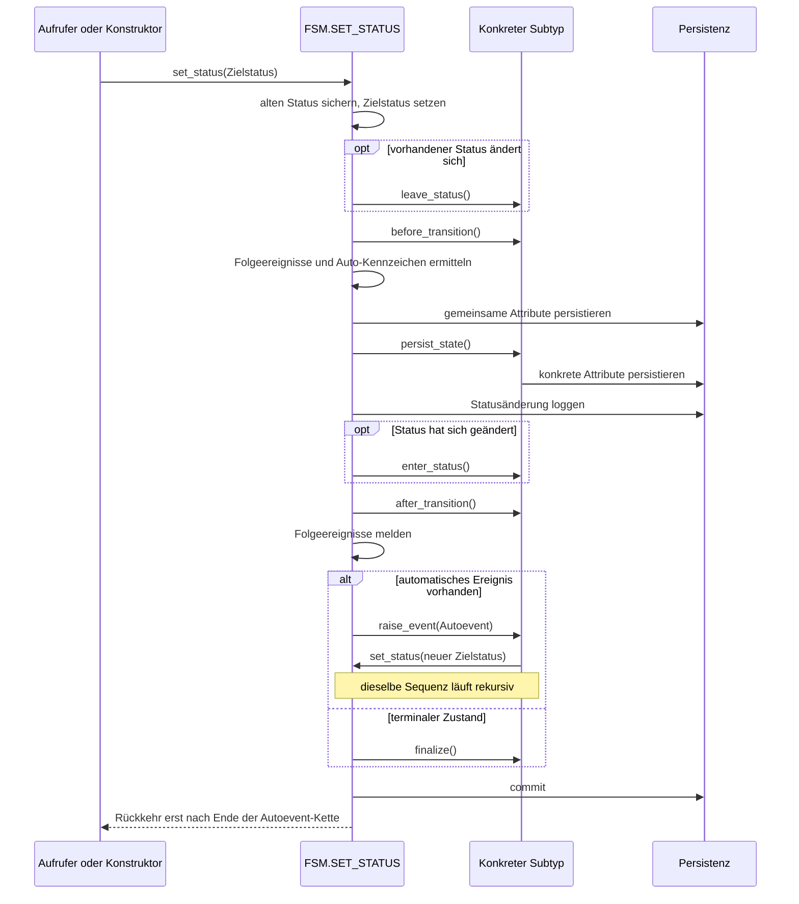

---
tags:
  - lifecycle
  - laufzeit
---

# Laufzeit und Lifecycle

Ein Statuswechsel verbindet eine fachliche Entscheidung mit den technischen Aufgaben des FSM-Frameworks. Die Fachlogik bestimmt den Zielstatus. `FSM.SET_STATUS` übernimmt anschließend den vollständigen Ablauf: Es wechselt den Zustand der Instanz, speichert die gemeinsamen und fachlichen Daten, protokolliert die Bewegung und verarbeitet mögliche Folgeereignisse.

Dieser Ablauf ist für jede abgeleitete FSM gleich. An fest definierten Stellen ruft der Laufzeitkern Methoden des konkreten FSM-Typs auf. Diese Methoden heißen [[Glossar/Lifecycle-Hook|Lifecycle-Hooks]] und bilden die vorgesehenen Einstiegspunkte für fachlichen Code. Ein konkreter FSM-Typ kann dort beispielsweise Ressourcen freigeben, Fachdaten speichern, eine Aktion beim Eintritt in einen Status ausführen oder nach dem Übergang weitere Fachaufgaben anstoßen.

`FSM.SET_STATUS` arbeitet synchron. Der Aufrufer erhält die Kontrolle zurück, nachdem der Statuswechsel und seine automatischen Folgeereignisse vollständig verarbeitet wurden.

## Phasen eines Statuswechsels

Ein Statuswechsel durchläuft acht aufeinander aufbauende Phasen.

### 1. Übergang vorbereiten

`SET_STATUS` sichert den bisherigen Status, übernimmt den Zielstatus und stellt fest, ob sich der Statuswert ändert. Der bisherige Status, das auslösende Ereignis und der neue Status stehen damit für die folgenden Phasen bereit.

### 2. Alten Status verlassen und Übergang vorbereiten

Bei einer tatsächlichen Statusänderung ruft der Kern zuerst `LEAVE_STATUS` auf. Hier kann der konkrete FSM-Typ Aktionen ausführen, die zum Verlassen des bisherigen Status gehören. Anschließend wird `BEFORE_TRANSITION` für jeden Übergang aufgerufen. Dieser Hook eignet sich für fachliche Vorbereitungen, die vor der Persistenz stattfinden sollen.

### 3. Folgemöglichkeiten ermitteln

Der Laufzeitkern liest aus den Metadaten, welche Ereignisse im Zielstatus erlaubt sind. Dabei wird zugleich bestimmt, ob ein Ereignis automatisch ausgelöst wird. Die FSM-Instanz enthält danach bereits die Ereignisliste ihres neuen Status.

### 4. Zustand persistieren

Zuerst speichert `FSM.PERSIST` die gemeinsamen Attribute der FSM in `FSM_OBJECTS`. Danach ruft der Kern `PERSIST_STATE` des konkreten Objekttyps auf. Dort speichert die fachliche FSM ihre zusätzlichen Attribute oder ruft das zuständige Fachpackage auf. Beide Persistenzschritte gehören zur selben Transaktion.

### 5. Bewegung protokollieren

`FSM.LOG_CHANGE` schreibt den Übergang in `FSM_LOG`. Der Eintrag verbindet bisherigen Status, neuen Status, auslösendes Ereignis, Meldung und Begründung zu einer nachvollziehbaren Bewegung des Fachobjekts.

### 6. Neuen Status betreten und Übergang abschließen

Bei einer tatsächlichen Statusänderung folgt `ENTER_STATUS`. Dieser Hook ist für Aktionen vorgesehen, die fachlich zum neuen Status gehören. Danach läuft `AFTER_TRANSITION` für jeden Übergang und bietet einen gemeinsamen Platz für fachliche Nacharbeiten.

### 7. Folgeereignisse verarbeiten

Der Kern veröffentlicht die im neuen Status erlaubten Ereignisse. Ein konfiguriertes automatisches Ereignis wird direkt auf derselben FSM-Instanz ausgelöst. Führt dieses Ereignis zu einem weiteren Status, beginnt der beschriebene Ablauf erneut. Dadurch wird die Instanz schrittweise bis zu einem stabilen oder terminalen Status geführt. Bei einem Terminalstatus ruft der Kern `FINALIZE` auf.

### 8. Übergang abschließen

Der Laufzeitkern bereinigt den vorübergehenden Ereignis- und Übergangskontext und führt den Commit aus. Der Aufrufer erhält anschließend die vollständig verarbeitete FSM-Instanz und das Ergebnis des Übergangs.

## Stellen für fachlichen Code

Die zentrale Methode gibt die Reihenfolge vor. Der konkrete FSM-Typ ergänzt seine Fachlogik an den dafür vorgesehenen Methoden:

| Stelle | Fachlicher Einfluss |
| --- | --- |
| Ereignishandler beziehungsweise `RAISE_EVENT` | Ereignis fachlich bewerten und Zielstatus bestimmen |
| `LEAVE_STATUS` | Aktionen beim Verlassen des bisherigen Status ausführen |
| `BEFORE_TRANSITION` | Daten und Aktionen vor der Persistenz vorbereiten |
| `PERSIST_STATE` | zusätzliche Daten der konkreten FSM oder des Fachobjekts speichern |
| `ENTER_STATUS` | Aktionen ausführen, die mit dem neuen Status beginnen |
| `AFTER_TRANSITION` | fachliche Nacharbeiten für jeden Übergang ausführen |
| `FINALIZE` | fachlichen Abschluss einer terminalen Instanz ausführen |

Die Hooks werden als Membermethoden auf der FSM-Instanz aufgerufen. Oracle wählt dabei die überschriebene Methode des konkreten Objekttyps. Der Type Body kann über einen direkten PL/SQL-Aufruf an das zugehörige Fachpackage delegieren. Damit bleiben Ablaufsteuerung und Transaktion im FSM-Kern, während die Fachentscheidungen in den Packages der Anwendung liegen.

## Zeitliche Abfolge

Das folgende Diagramm fasst diese Phasen und Aufrufpunkte in ihrer zeitlichen Reihenfolge zusammen.

## Bedeutung der Hooks

| Hook | Zeitpunkt | Typischer Zweck |
| --- | --- | --- |
| `LEAVE_STATUS` | vor dem Verlassen eines vorhandenen Status | Aufräumen des alten Zustands |
| `BEFORE_TRANSITION` | vor jeder Persistenz | ereignisabhängige Voraktionen |
| `PERSIST_STATE` | nach gemeinsamer FSM-Persistenz | konkrete Attribute speichern |
| `ENTER_STATUS` | nach Persistenz und Log bei Statusänderung | Aktionen des neuen Zustands |
| `AFTER_TRANSITION` | nach Eintritt beziehungsweise Log | statusübergreifende Nachaktionen |

Der Laufzeitkern führt die Transaktionskontrolle für gemeinsame Daten, konkrete Daten und Logeinträge aus. `PERSIST_STATE` beteiligt sich an dieser Transaktion und überlässt den Commit dem Laufzeitkern.

## Initialer Eintritt

Beim Aufbau einer neuen Instanz ist der vorherige Status leer. Der Lifecycle beginnt in diesem Fall mit `BEFORE_TRANSITION` und führt anschließend Persistenz, Logging, `ENTER_STATUS` und `AFTER_TRANSITION` aus. Ein Autoevent wird innerhalb von `SET_STATUS` ausgeführt; danach liefert der Konstruktor die stabilisierte Instanz zurück.

## Unveränderter Status

Ein Ereignis kann Aktivität bei gleichbleibendem Status melden. In diesem Fall umfasst der Ablauf Persistenz, Logging, `BEFORE_TRANSITION` und `AFTER_TRANSITION`. Das Datum der letzten Aktivität wird aktualisiert; das Datum des letzten Statuswechsels behält seinen Wert.

## Terminaler Status

Ein [[Glossar/Terminalstatus|terminaler Status]] kennzeichnet den fachlichen Abschluss des modellierten Lebenszyklus. Beispiele sind `ABGESCHLOSSEN`, `STORNIERT` oder ein endgültiger Fehlerstatus. Die FSM-Instanz bleibt mit ihrem letzten Status und ihrer Bewegungshistorie erhalten und dokumentiert damit das Ergebnis des Prozesses.

Das Metadatenmodell kennzeichnet einen solchen Status über `FST_TERMINAL_STATUS`. Eine Transition auf das technische Ereignis `NIL` bildet das Ende des Ereignisgraphen ab. Nach dem Eintritt in den terminalen Status enthält `FSM_FEV_LIST` deshalb den Wert `NIL`.

Der Statuswechsel in einen terminalen Status durchläuft zunächst denselben Lifecycle wie jeder andere Statuswechsel:

1. `LEAVE_STATUS` und `BEFORE_TRANSITION` führen die vorbereitenden Aktionen aus.
2. `FSM.PERSIST` und `PERSIST_STATE` speichern FSM- und Fachdaten.
3. `FSM.LOG_CHANGE` protokolliert den abschließenden Übergang.
4. `ENTER_STATUS` und `AFTER_TRANSITION` führen die fachlichen Eintritts- und Nachaktionen aus.
5. Der Laufzeitkern erkennt `NIL` in der Ereignisliste und ruft `FINALIZE` auf.
6. Der Commit schließt den Übergang und die Finalisierung gemeinsam ab.

`FINALIZE` ist der vorgesehene Hook für Arbeiten, die zum Ende einer FSM-Instanz gehören. Ein konkreter Objekttyp kann die Methode überschreiben und über einen direkten Packageaufruf beispielsweise Abschlussdaten erzeugen, fachliche Ressourcen freigeben oder eine abschließende Benachrichtigung vorbereiten. Die Implementierung beteiligt sich an der vom Laufzeitkern kontrollierten Transaktion.

Der terminale Status beschreibt damit sowohl das fachliche Prozessergebnis als auch den technischen Endpunkt der automatischen Ereignisverarbeitung. Der Konstruktor beziehungsweise ursprüngliche Ereignisaufrufer erhält die Instanz nach Abschluss von `FINALIZE` und Commit zurück.
