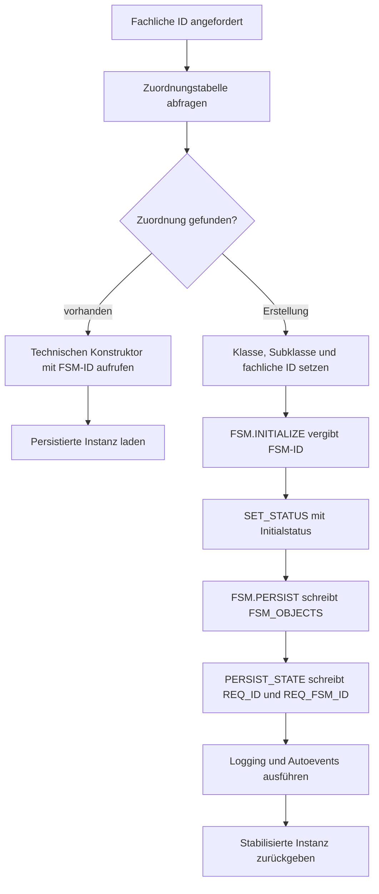

# Instanzen erstellen und laden

Eine konkrete FSM verbindet zwei Identitäten:

- Die fachliche ID identifiziert das begleitete Fachobjekt, beispielsweise einen Datenträger, Auftrag oder eine Anfrage.
- Die technische `FSM_ID` identifiziert die zugehörige Instanz in `FSM_OBJECTS`.

Eine Zuordnungstabelle verbindet beide IDs. Sie ermöglicht den Zugriff in beide Richtungen: Ausgehend vom Fachobjekt kann die Anwendung jederzeit seine FSM ermitteln, und ausgehend von der FSM kann die Fachlogik das begleitete Fachobjekt laden.

Konkrete Typen besitzen dafür üblicherweise zwei Konstruktoren:

- einen fachlichen Konstruktor zum Ermitteln oder Erstellen über die fachliche ID
- einen technischen Konstruktor zum Laden über `FSM_ID`

## Aufgabenteilung

FSM-Kern und Fachlogik übernehmen beim Erstellen und Laden klar getrennte Aufgaben.

| Beteiligter Bereich | Aufgabe |
| --- | --- |
| fachlicher Konstruktor | fachliche ID entgegennehmen und die Zuordnungstabelle abfragen |
| `FSM.INITIALIZE` | neue `FSM_ID` vergeben und den Ereigniskontext auf `INITIALIZE` setzen |
| `FSM.SET_STATUS` | initialen Status verarbeiten und den vollständigen Lifecycle ausführen |
| `FSM.PERSIST` | gemeinsame FSM-Daten in `FSM_OBJECTS` speichern |
| konkretes `PERSIST_STATE` | Zuordnung von `FSM_ID` und fachlicher ID sowie weitere konkrete Daten speichern |
| `FSM.LOG_CHANGE` | initiale Bewegung in `FSM_LOG` protokollieren |
| technischer Konstruktor | persistierte FSM- und Fachdaten in den konkreten Objekttyp laden |

Der FSM-Kern kennt die technische `FSM_ID` und die gemeinsamen FSM-Attribute. Die Fachlogik kennt die fachliche ID, die Zuordnungstabelle und die Tabellen des Fachobjekts. `PERSIST_STATE` verbindet beide Verantwortungsbereiche innerhalb des zentral gesteuerten Statuswechsels.

## Zuordnungstabelle

Die Sample-App verwendet `FSM_REQUESTS` zugleich als Fachtabelle und als Zuordnungstabelle. `REQ_ID` ist die fachliche ID der Berechtigungsanfrage. `REQ_FSM_ID` verweist eindeutig auf die begleitende Instanz in `FSM_OBJECTS`.

```sql
create table fsm_requests(
  req_id number default on null fsm_request_seq.nextval,
  req_fsm_id number not null,
  req_rtp_id varchar2(50 char),
  req_rre_id varchar2(50 char),
  req_text varchar2(1000 char),
  constraint pk_fsm_requests primary key (req_id),
  constraint uk_req_fsm_id unique (req_fsm_id),
  constraint fk_req_fsm_id foreign key (req_fsm_id)
    references fsm_objects(fsm_id) on delete cascade
);
```

`FSM_REQUEST_SEQ` erzeugt die fachliche `REQ_ID`. Die technische `FSM_ID` stammt weiterhin aus `FSM_SEQ`. Der Unique Constraint auf `REQ_FSM_ID` bildet die Eins-zu-eins-Zuordnung ab. Die vollständige Tabellendefinition liegt in `FSM/sample_app/tables/fsm_requests.tbl`.

## Neue Instanz

Der fachliche Konstruktor delegiert an das konkrete FSM-Package. Dieses sucht zunächst die fachliche ID in der Zuordnungstabelle. Der Erstellungspfad beginnt mit einer neuen fachlichen ID.

Die Initialisierung läuft anschließend in dieser Reihenfolge:

1. Der konkrete Konstruktor setzt Klasse, Subklasse, fachliche ID und weitere konkrete Attribute im Objekt.
2. `FSM.INITIALIZE` vergibt die `FSM_ID` und setzt das auslösende Ereignis auf `INITIALIZE`.
3. Der Konstruktor ruft die geerbte Methode `SET_STATUS` mit dem Initialstatus auf.
4. `FSM.SET_STATUS` führt die vorbereitenden Lifecycle-Hooks aus und ermittelt die Folgeereignisse des Initialstatus.
5. `FSM.PERSIST` legt den gemeinsamen Datensatz mit der neuen `FSM_ID` in `FSM_OBJECTS` an.
6. Der Laufzeitkern ruft `PERSIST_STATE` des konkreten Objekttyps auf.
7. `PERSIST_STATE` delegiert an das konkrete Package. Dieses schreibt die `FSM_ID` zusammen mit der fachlichen ID in die Zuordnungstabelle und persistiert weitere konkrete Attribute.
8. `FSM.LOG_CHANGE` protokolliert den Eintritt in den Initialstatus.
9. Eintritts- und Nachaktionshooks sowie automatische Folgeereignisse werden ausgeführt.
10. Der Laufzeitkern schließt die Transaktion ab und der Konstruktor liefert die stabilisierte Instanz zurück.

Der Eintrag in `FSM_OBJECTS` und der Eintrag in der Zuordnungstabelle entstehen damit in derselben Transaktion. Die Reihenfolge erlaubt zugleich den Fremdschlüssel der Zuordnungstabelle auf `FSM_OBJECTS`.

Eine typische Implementierung von `PERSIST_STATE` bleibt als Objektmethode kurz und ruft das konkrete Package direkt auf:

```sql
overriding member procedure persist_state(
  self in out nocopy fsm_req_type)
as
begin
  fsm_req.set_status(self);
end persist_state;
```

`FSM_REQ.SET_STATUS` delegiert an die interne Persistenzroutine und diese wiederum an `BL_REQUEST.MERGE_REQUEST`. Der relevante Aufruf übergibt beide IDs ausdrücklich:

```sql
bl_request.merge_request(
  p_req_id => p_req.req_id,
  p_req_fsm_id => p_req.fsm_id,
  p_req_rtp_id => p_req.req_rtp_id,
  p_req_rre_id => p_req.req_rre_id,
  p_req_text => p_req.req_text);
```

`BL_REQUEST.MERGE_REQUEST` führt das `MERGE` anhand der fachlichen `REQ_ID` aus und speichert `REQ_FSM_ID` als technische Zuordnung.



## Vorhandene Instanz

Beim Zugriff über die fachliche ID liest das konkrete Package zuerst die zugehörige `FSM_ID` aus der Zuordnungstabelle. Anschließend ruft es den technischen Konstruktor mit dieser `FSM_ID` auf.

Der technische Konstruktor liest eine gemeinsame View, die `FSM_OBJECTS`, die Zuordnungstabelle und gegebenenfalls weitere konkrete Tabellen verbindet. Er befüllt den Objekttyp mit:

- `FSM_ID`, Klasse, Subklasse und aktuellem Status
- aktuellem Ereignis, Ereignisliste und Gültigkeit
- fachlicher ID
- weiteren konkreten Attributen

Der Konstruktor bildet damit den persistierten Zustand im Speicher ab. Status, Persistenz und Log behalten ihre gespeicherten Werte. Die geladene Instanz kann anschließend Ereignisse entgegennehmen und den regulären Lifecycle durchlaufen.

Die eindeutige Zuordnung auf der fachlichen ID stellt sicher, dass jede Abfrage für ein Fachobjekt dieselbe FSM-Instanz ermittelt.

Da ein FSM-Objekt in einer Tabelle abgelegt ist, können langlaufende Prozesse jederzeit den aktuellen Stand des Objekts aus den Daten rekonstruieren und den Ablauf fortsetzen. Dies steht im Gegensatz zu vielen anderen Implementierungen, die ihren aktuellen Status ausschließlich im Arbeitsspeicher einer Anwendung tragen. Auf diese Weise werden auch Prozesse unterstützt, die mehrere Tage oder noch längere Zeiträume überdauern, etwa der Lebenszyklus eines veröffentlichten Dokuments oder der Verlauf einer Bestellung.

## Vertrag eines Konstruktors

Ein Neu-Konstruktor liefert eine vollständig initialisierte und dem Fachobjekt zugeordnete Instanz. Bei seiner Rückkehr sind Initialstatus, gemeinsame Persistenz, Zuordnung, Logeintrag und automatische Initialereignisse verarbeitet. Ein Lade-Konstruktor bildet den gespeicherten Zustand einschließlich der fachlichen Zuordnung ab.
